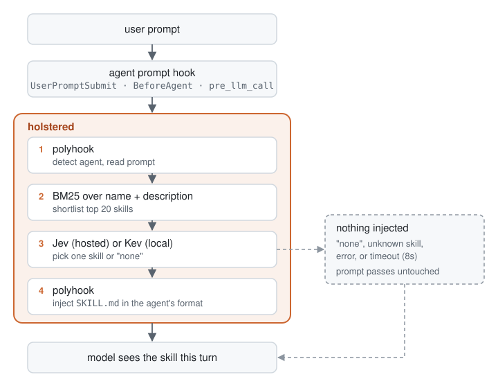
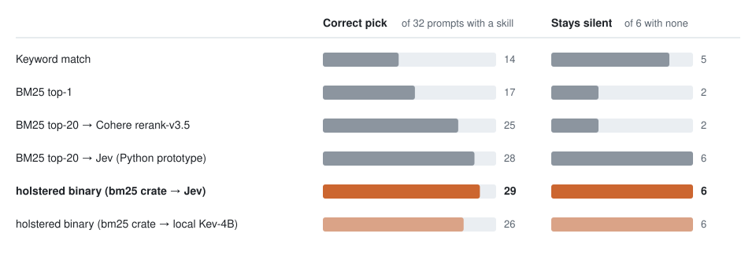

<p align="center"></p>

# holstered

**Your agent has 500+ skills holstered. It draws none. holstered draws the right one.**

Fastest draw in the terminal: one skill, or none, in about a second.

<sub>English &middot; <a href="docs/README.zh-CN.md">简体中文</a></sub>

You type **"make me a 5 slide deck about our Q3 results"**:

| | Without holstered | With holstered |
|---|---|---|
| What the agent knows about your PowerPoint skill | One line, lost among 581 others | The full skill, loaded before it starts |
| What happens next | It may write the deck from scratch and ignore your skill | It follows your skill's instructions |

You type **"thanks, that fixed it"**: no skill fits, so holstered adds nothing.

Agents with hundreds of skills see only their names, so the one that fits the
task often goes unused. holstered is a prompt hook: on every user prompt it
shortlists skills with BM25, asks a decision model to pick one (or none), and
injects that skill's `SKILL.md` into the model's context for the turn. A prompt
that spans several tasks also gets up to 2 runner-up skills over the
[runner-up threshold](CONFIGURATION.md).

https://github.com/user-attachments/assets/b6de382b-8ca3-4fe0-9baa-0039342dd3b0

The decision model is your choice: **Jev**, hosted on OpenRouter, or **Kev**,
an open model you run locally so nothing leaves your machine. See
[Choose a decision model](#choose-a-decision-model).

One Rust binary serves every agent through [polyhook](https://github.com/polyhook/polyhook),
which translates each agent's hook payload and response format.

## How it works

<p align="center"></p>

Nothing is injected, and the prompt goes through untouched, when the decision
model answers `none`, names a skill it was not offered, fails or times out
(8s by default), or none is configured. holstered never blocks a prompt.

An injected `SKILL.md` is capped at 8,000 bytes, since some agents cut hook
output past ~10KB. A longer skill is cut there and ends with a pointer to the
file for the rest, which the model may not follow. Keep `SKILL.md` under 8KB
(about 100 lines of prose; check with `wc -c`) and move detail into files it
references.

### Why BM25 + a decision model

On a 38-prompt labeled set over a 581-skill library (32 prompts with a correct
skill, 6 with none):

<p align="center"></p>

The holstered rows are the release binary run end to end against live Jev
(median 915 ms per prompt) and a local Kev-4B on an Apple Silicon Mac (median
1.7s). One of its three misses picked a `pptx` skill for a
slide-deck prompt the labels credited only to another skill. Small set, single labeler: read it as a direction, not a
guarantee.

## Supported agents

Agent support comes from polyhook; see its [Supported Tools](https://github.com/polyhook/polyhook#supported-tools)
for the full list and which agents can take context injection.

| Agent | Hook | Injection |
|---|---|---|
| Claude Code | `UserPromptSubmit` | ✅ |
| Codex | `UserPromptSubmit` | ✅ |
| Gemini CLI | `BeforeAgent` | ✅ |
| Hermes Agent | `pre_llm_call` | ✅ |
| Cline | `UserPromptSubmit` | ✅ |
| Cursor, Windsurf, Amp | — | ❌ their prompt hooks can only allow or block, so there is nothing to register |

## Install

Pick one:

```bash
# npm (prebuilt binary, no Rust toolchain)
npm install -g holstered

# Go (downloads the prebuilt binary on first run)
go install github.com/tupe12334/holstered/go/cmd/holstered@latest
# or pin it in a Go project (Go 1.24+): go get -tool github.com/tupe12334/holstered/go/cmd/holstered

# crates.io
cargo install holstered

# Homebrew (builds from source)
brew install tupe12334/tap/holstered

# latest main from GitHub
cargo install --git https://github.com/tupe12334/holstered
```

Then [choose a decision model](#choose-a-decision-model) and add holstered to
each agent you use:

**Claude Code** — install the plugin (send the two commands as separate prompts):
```
/plugin marketplace add tupe12334/holstered
```
```
/plugin install holstered@holstered
```

**Codex** — install the plugin, then open `/hooks` in `codex` and trust its hook:
```bash
codex plugin marketplace add tupe12334/holstered
codex plugin add holstered@holstered
```

**Gemini CLI** — install the extension:
```bash
gemini extensions install https://github.com/tupe12334/holstered
```

**Hermes Agent** — install the plugin, then restart Hermes:
```bash
hermes plugins install tupe12334/holstered#plugins/hermes --enable
```

**Cline** — hooks are executables named after the event
```bash
mkdir -p ~/Documents/Cline/Hooks
ln -s "$(command -v holstered)" ~/Documents/Cline/Hooks/UserPromptSubmit
```

## Choose a decision model

Set one of these in the environment your agent starts from. If both are set,
Kev wins.

| | Jev (hosted) | Kev (local) |
|---|---|---|
| Set | `OPENROUTER_API_KEY` | `HOLSTERED_KEV_URL` |
| Runs | OpenRouter Decisions API | [Kev](https://github.com/jaredpalmer/kev) server on your machine |
| Privacy | prompt (first 500 + last 1,500 chars) and shortlisted skill descriptions go to OpenRouter | nothing leaves the machine |
| Latency per prompt | ~1s | ~1.7–3.5s on an Apple Silicon Mac |
| Accuracy on the set above | 29/32 | 26/32 |

Kev setup and first-request timeout: [CONFIGURATION.md](CONFIGURATION.md#local-model-kev).

## Configuration

Environment variables, the data sent to OpenRouter, and running fully offline
with a local Kev model: see [CONFIGURATION.md](CONFIGURATION.md).

## Contributing

See [CONTRIBUTING.md](CONTRIBUTING.md).

## License

[MIT](LICENSE)
